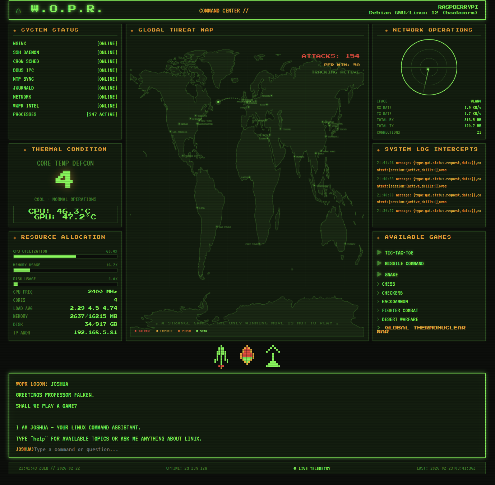

# 🖥️ WOPR — War Operation Plan Response Dashboard

> *"A strange game. The only winning move is not to play."*

A retro **War Games** (1983) inspired system monitoring dashboard for Raspberry Pi, designed to replace the default nginx landing page with a fully functional command center.

Live telemetry. Real attack data. Playable retro games. CRT scanlines. What more could you want?




## Features

- **Live System Telemetry** — CPU, memory, disk, network stats updated every 3 seconds
- **DEFCON Thermal Monitor** — CPU temperature mapped to DEFCON levels with throttle warnings
- **Global Threat Map** — Natural Earth GeoJSON world map with animated attack arcs, realistic CVE/malware names, and rolling strike counter
- **Playable Retro Games** — Tic-Tac-Toe vs JOSHUA (movie-accurate!), Missile Command, and Snake — all in CRT-styled pop-up modals
- **Network Operations Radar** — Real-time RX/TX rates, active connections, with animated radar display
- **System Log Intercepts** — Live journal log feed displayed in-dashboard
- **Real SSH Attack Data** — Parses `auth.log` for actual failed login attempts
- **Interactive JOSHUA Terminal** — In-browser Linux command helper chatbot (pattern-matching, no LLM required). Covers 40+ commands and 20+ "how to" topics. War Games easter eggs included.
- **Service Status Monitor** — Live status of nginx, SSH, cron, dbus, NTP, journald, network, and the WOPR stats service
- **CRT Aesthetic** — Scanlines, phosphor glow, pixel sprites, VT323 + Press Start 2P fonts
- **Responsive** — Collapses to single-column on mobile

## Games

Three playable retro games, all in the War Games aesthetic:

- **Tic-Tac-Toe vs JOSHUA** — Play against the WOPR AI. You're X (green), JOSHUA is O (amber). Draws trigger the iconic movie quote. Just like the film's climax.
- **Missile Command** — Defend 6 cities from incoming ICBMs. Click to fire counter-missiles. Waves escalate. Very thematic.
- **Snake** — Classic 8-bit snake on a green-phosphor grid. Arrow keys to move.

Games open in CRT-styled modal popups. Close with ✕, Escape, or clicking outside. The original movie game list (Chess, Checkers, Global Thermonuclear War) remains for atmosphere — clicking "Global Thermonuclear War" still triggers the classic response.

## Architecture

```
┌──────────────┐       ┌───────────────────┐       ┌──────────────┐
│  Browser     │──────▸│  nginx            │──────▸│  index.html  │
│  (any device)│       │  :80              │       │  (dashboard) │
└──────────────┘       └───────────────────┘       └──────┬───────┘
                              │                           │
                              │ serves static             │ fetches
                              ▼                           ▼
                       /var/www/html/             /api/stats.json
                              │                         ▲
                              │                         │ writes
                       /data/ne_110m_land.json  ┌───────┴────────┐
                       (Natural Earth GeoJSON)  │ wopr-stats.sh  │
                                                │ (systemd svc)  │
                                                │ runs every 2s  │
                                                └────────────────┘
```

**Zero external dependencies** at runtime — no Node.js, no Python, no databases. Just bash, nginx, and a browser.

## Quick Install

### Prerequisites

- Raspberry Pi (tested on Pi 5, should work on Pi 3/4/Zero 2)
- Raspberry Pi OS (Debian-based)
- nginx installed (`sudo apt install nginx`)
- `bc` package (`sudo apt install bc`)

### One-Line Install

```bash
git clone https://github.com/dougrichards13/nginx_WOPR.git
cd nginx_WOPR
sudo bash install.sh
```

### Manual Install

```bash
# Copy dashboard to nginx root
sudo cp src/index.html /var/www/html/index.nginx-debian.html

# Install stats gatherer
sudo cp src/wopr-stats.sh /usr/local/bin/wopr-stats.sh
sudo chmod +x /usr/local/bin/wopr-stats.sh

# Fix line endings (if transferred from Windows)
sudo sed -i 's/\r$//' /usr/local/bin/wopr-stats.sh

# Create API directory
sudo mkdir -p /var/www/html/api

# Install and start systemd service
sudo cp src/wopr-stats.service /etc/systemd/system/
sudo systemctl daemon-reload
sudo systemctl enable --now wopr-stats

# Verify
curl -s http://localhost/api/stats.json | head -5
```

Then visit `http://<your-pi-ip>/` in a browser.

## Updating

Pull the latest and re-run the installer:

```bash
cd nginx_WOPR
git pull
sudo bash install.sh
```

## Multi-Device Deployment

This project is designed with multi-Pi homelab setups in mind. Each Pi runs its own independent WOPR instance — the dashboard reads from the local `/api/stats.json` and displays that machine's identity (hostname, IP, OS) automatically.

**To deploy to a new Pi:**

```bash
# From your workstation:
ssh user@new-pi "git clone https://github.com/dougrichards13/nginx_WOPR.git && cd nginx_WOPR && sudo bash install.sh"
```

**Planned multi-device features (future):**
- Central "War Room" dashboard aggregating all Pi nodes
- Node discovery / fleet status overview
- Cross-node alerting (e.g. if a Pi goes offline)
- Per-node configuration (custom names, DEFCON thresholds, monitored services)

## Customization

### Changing Monitored Services

Edit `src/wopr-stats.sh` — the `svc_status()` calls near line 96 control which services are reported. Update the HTML `status-line` entries to match.

### Adjusting DEFCON Thresholds

In `src/index.html`, find the `tempToDefcon()` function and adjust the temperature breakpoints.

### Adding Cities to the Threat Map

The `cities` array in `src/index.html` holds `[name, longitude, latitude]` entries. Add your own strategic locations.

### Adding Games

Each game is a self-contained `init` function in the mini-games engine section of `src/index.html`. To add a new game: create an `initYourGame()` function that draws on `gameCanvas`, add it to the `GAMES` map, and add a `<li class="playable" data-game="yourgame">` entry to the game list.

## Security Notes

- **The stats script runs as root** via systemd to access thermal sensors and service status. Review `src/wopr-stats.sh` before installing — it only reads system information and writes JSON to the nginx web root.
- **No data leaves the Pi.** The dashboard fetches only from the local `/api/stats.json` endpoint. The only external request is loading Google Fonts (can be removed for air-gapped setups).
- **The "attacks" on the threat map are simulated** for visual effect. Real SSH brute-force attempts from `auth.log` are included in the stats JSON but are currently displayed in the log panel, not on the map.
- **No authentication.** Anyone on your network can view the dashboard. If your Pi is exposed to the internet, consider adding nginx basic auth or firewall rules.

See [SECURITY.md](SECURITY.md) for the full security policy and how to report vulnerabilities.

## Credits

- Inspired by the 1983 film *WarGames* and the WOPR/Joshua system
- Built with [Warp](https://www.warp.dev/) AI-assisted agentic development (co-authored by Warp's AI agent)
- Map data: [Natural Earth](https://www.naturalearthdata.com/) 110m land polygons (public domain)
- Fonts: [Press Start 2P](https://fonts.google.com/specimen/Press+Start+2P) and [VT323](https://fonts.google.com/specimen/VT323) from Google Fonts

## License

MIT — see [LICENSE](LICENSE). Free to use, modify, and distribute.

---

*"Shall we play a game?"*
